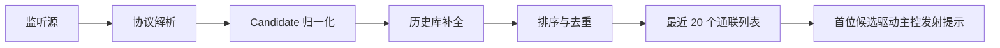

# 实时通联列表获取与融合方案

本文档沉淀 HAM 台网点名主控台当前较稳定的“实时通联列表”实现方式，供 FMO-Dashboard、桌面版、本地设备监听、HAMBOX/MMDVM 适配和其它 HAM 工具复用。

## 目标

台网点名场景需要的是“主控能快速从实时通联中选中抄收清楚的友台”，因此实时列表的设计目标不是完整复刻某一个后端协议，而是形成一个稳定、可排序、可去重、可补全资料的统一候选列表。

核心目标：

- 监听源可以不同，但 UI 只消费同一种候选对象。
- 列表第一行代表当前最应关注的呼叫。
- 呼号、时间、QTH、设备、功率、模式等字段尽可能从监听源、历史库和外部资料补全。
- 断线、超时、混合协议和历史记录回放不能污染实时状态。
- 能支持 FMO、BM DMR、MMDVM、HAMBOX，并为 YSF/FCS/D-Star/P25/NXDN 预留入口。

## 与 FMO-Dashboard 原逻辑的关系

FMO-Dashboard 的仪表盘逻辑主要围绕单一 FMO 服务展开：

- 使用 `speakingHistory` 维护正在发言和刚结束发言的记录。
- `activeContact` 从当前未结束的 speaking 记录中取当前呼叫。
- `displayRecords` 将 speakingHistory 和 FMO 日志记录合并，生成最近 20 个通联。
- FMO 日志用于补足 QTH、留言、中继名称、历史通联信息等。
- `ACTIVE_CONTACT_LINGER_MS` 让刚结束的通联短暂停留在当前卡片上，便于视觉过渡。

这个模型适合 FMO 仪表盘，因为 FMO 能提供较清晰的事件流和日志数据。

本项目在这个基础上做了扩展和改进：

- 从“FMO 专用状态模型”扩展为“多监听源统一候选列表模型”。
- 不强依赖某个协议的字段名，而是把各来源先归一化成统一 Candidate。
- FMO 仍使用实时事件作为主路径，但不再首次进入时用日志页假装实时数据。
- BM DMR 使用 BrandMeister WebSocket 实时订阅通话组，同时过滤初始化历史包。
- MMDVM/HAMBOX 通过 Last Heard 或设备数据轮询进入同一候选列表。
- 主控发射提示以“实时列表首位是否匹配主控核心呼号”为核心 UI 规则，而不是绑定某个协议的事件语义。

## 统一 Candidate 模型

各监听源进入 UI 前，都应转换为如下结构：

```js
{
  id: 'source-specific-id',
  callsign: 'BH1JSS',
  time: '2026-06-22 20:15',
  durationSeconds: 0,
  liveStartedAt: 0,
  qth: '北京 昌平',
  grid: 'OM89xx',
  device: 'FTM-400DR',
  power: 'L',
  mode: 'FMO',
  comment: '正在发言',
  relayName: '如意甘肃',
  sourceLabel: '正在通联',
  isSpeaking: true,
  raw: {}
}
```

字段约定：

- `callsign` 必须标准化为大写半角。
- `time` 用于显示和排序，尽量包含年月日。
- `sourceLabel` 用于提示来源，例如 `正在通联`、`最近发言`、`BM实时`、`MMDVM`。
- `isSpeaking` 只表达“当前确认正在说话”，不要把历史 Last Heard 误标成 true。
- `raw` 保留原始字段，方便后续判断事件类型和调试。

## 归一化流程

推荐数据流如下：



各来源适配层只负责“解析并归一化”，不要直接操作 UI：

- FMO：事件流生成 live row，日志/API 只用于补全资料。
- BM DMR：WebSocket 订阅 TG，实时 MQTT 包生成 Candidate。
- MMDVM：`/mmdvmhost/lh.php` 解析 Last Heard 表格。
- HAMBOX：读取设备 Dashboard JSON 或等价接口。
- 其它模式：先保留地址栏和模式入口，待确认接口后增加 adapter。

## FMO 实时读取策略

FMO 监听应优先使用事件流：

1. 建立 `/events` 或等价 WebSocket 实时事件连接。
2. 收到发言开始事件后写入 speaking history。
3. 收到结束事件后给对应记录补 `endTime`。
4. 用日志/API 只做辅助补全，不把历史日志当成当前实时列表首位。
5. 如果 API 控制通道超时，但事件通道可用，应保持实时监听继续工作。

关键点：

- 首次打开 FMO 地址时，列表可以从空开始逐步累积，不要用日志页一次性填满并伪装成实时。
- `当前中继/服务器` 名称可通过控制 API 或事件字段补全。
- Maidenhead Grid 可异步解析成省市区县显示，但不应阻塞实时列表更新。

## BM DMR 读取策略

BrandMeister 可通过 WebSocket 订阅通话组：

- 连接 `wss://api.brandmeister.network/lh/socket.io/?EIO=4&transport=websocket`
- 完成 Engine.IO / Socket.IO 握手。
- 加入 `dst_<talkgroup>`。
- 实时 MQTT 消息转换为 Candidate。

处理注意：

- `LH-Startup` 是连接初始化时返回的历史/缓存数据，不应触发“正在发射”。
- `Session-Start` 可视为实时开始。
- `Session-Stop`、`End`、`Timeout` 等应视为结束。
- 需要以 `SessionID`、`SourceID`、时间窗口去重，避免同一呼号短时间重复刷屏。
- QTH 和设备可通过 BrandMeister device API 进一步补全。

## MMDVM 与 HAMBOX 读取策略

MMDVM 常见可用入口：

- `http://<ip>/mmdvmhost/lh.php`
- `http://<ip>/` 仪表盘首页用于读取网络名称，例如 YSF 网络、DMR Talk Group、D-Star Reflector。

HAMBOX 可类似读取 Dashboard 数据接口或页面数据。

这类来源经常是 Last Heard，而不是严格实时事件流，因此应遵守：

- Last Heard 首行可以代表“最新听到的对象”。
- 如果该来源没有明确 transmitting 状态，不要永久标记 `isSpeaking=true`。
- UI 层可用“首位是否变化”辅助判断刚刚发生的发射，但下一轮首位不变时应恢复普通状态。
- 如果设备接口提供 `transmitting`、`tx`、`speaking` 等明确状态，应优先使用明确状态。

## 主控发射提示规则

主控发射栏不应直接绑定某一个协议。推荐 UI 规则如下：

1. 从实时列表取首位 Candidate。
2. 提取首位呼号和登记主控呼号的核心呼号。
3. 如果核心呼号一致，则进入“主控正在发射/发言”状态。
4. 下一次刷新时，如果首位不再是主控，立即恢复普通状态。
5. 如果来源提供明确结束事件，收到结束事件时立即恢复普通状态。
6. 如果来源没有稳定结束事件，应设置 1 秒级短失活兜底：首位短时间无变化且无继续发射证据时自动恢复普通状态。

核心呼号示例：

- `B3/BH1JSS` 的核心呼号是 `BH1JSS`
- `BH1JSS/1DR` 的核心呼号是 `BH1JSS`
- `B3/BH1JSS/1DR` 的核心呼号仍应识别为 `BH1JSS`

这条规则比“只看 isSpeaking 字段”更符合点名主控的实际体验，因为不同来源对发射状态的表达差异很大，但实时列表首位通常就是当前最重要的呼叫对象。

实际实现时还要遵守“明确状态优先”：

- FMO 有实时开始/结束事件，优先使用事件恢复。
- BM DMR 有 `Session-Start` / `Session-Stop` 时，优先使用会话事件。
- HAMBOX 若返回 `transmitting`，优先使用该状态；首位仍是主控但 `transmitting=false` 时必须恢复。
- MMDVM Last Heard 没有严格结束事件，只能用首位变化和 1 秒级短失活兜底。

## 排序与去重

推荐排序：

1. `isSpeaking=true` 的候选优先。
2. 其次按 `time` 倒序。
3. 对同一呼号保留最新一条。
4. BM 等高频来源可用时间窗口去重，避免同一 Session 多次进入列表。

推荐去重键：

```js
const key = [
  source,
  sessionId || callsign,
  timestampMinute,
  eventType
].join('|')
```

对 FMO 这类同一呼号可能连续发言的场景，可按 `callsign + startTime` 保留 live row，再与日志记录按时间窗口匹配。

## 历史库补全

实时监听源不一定提供完整资料。建议补全优先级：

1. 监听源实时字段。
2. 外部资料接口，例如 BrandMeister device API。
3. 本项目基础呼号库。
4. 本次点名活动已记录数据。
5. 用户手动输入后写回基础库。

补全字段包括：

- QTH
- 设备
- 功率
- 模式
- 信号报告

补全应异步执行，避免阻塞首位实时刷新。

## 适配新监听源的步骤

新增一个监听源时，按此流程做：

1. 确认该来源是事件流、WebSocket、HTTP 轮询、HTML 页面还是 JSON API。
2. 写一个独立 service 负责 fetch/parse。
3. 写 `normalizeXxxQso()` 转为统一 Candidate。
4. 把结果交给统一排序去重逻辑。
5. 明确该来源是否有真实 `isSpeaking`。
6. 若无真实发射状态，则只让首位变化驱动短时提示，不能永久视为发射。
7. 为来源增加连接失败、超时、CORS/HTTPS 限制提示。

## 已知边界

- 公网页面无法直接代表服务器访问用户局域网设备；能否访问局域网设备取决于用户浏览器、安全策略、HTTPS/mixed content 和目标设备 CORS。
- Last Heard 不等于实时发射状态，必须谨慎映射。
- 不同网络的时间字段格式差异很大，进入统一模型前必须规范化。
- WebSocket 初始化历史包要与实时包区分，否则会误触发当前发射提示。
- 主控发射提示应以列表首位为准，不应因为主控呼号出现在列表第 2-20 行而高亮。

## 复用建议

其它项目可直接复用这套分层：

- `source client`：负责连接和抓取。
- `parser`：负责解析原始响应。
- `normalizer`：转换为 Candidate。
- `enricher`：异步补全 QTH/设备/功率。
- `feed store`：负责排序、去重、截取最近 20 条。
- `active speaker adapter`：由首位 Candidate 驱动 UI 状态。

这样未来无论接入 D-Star、YSF、FCS、P25、NXDN 还是新的硬件盒子，都不会把协议细节散落到页面组件里。
